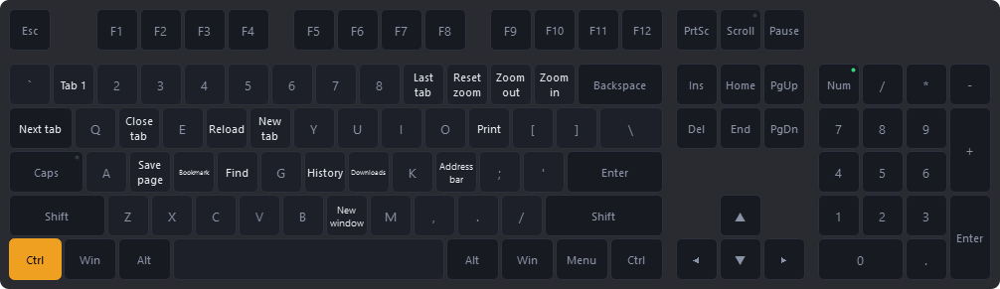
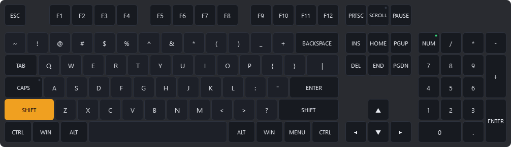
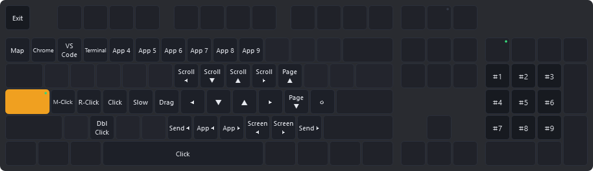
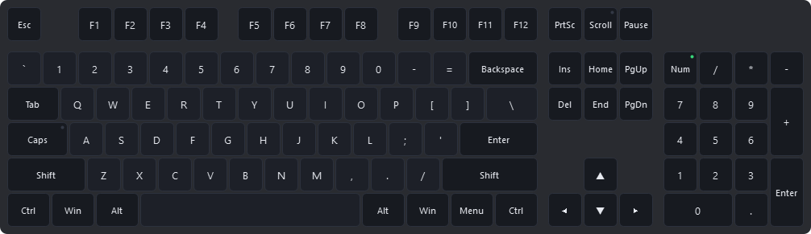
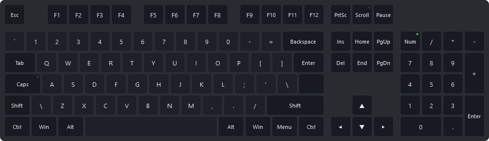
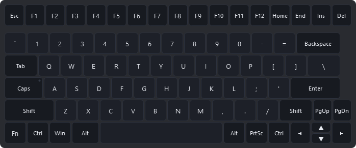
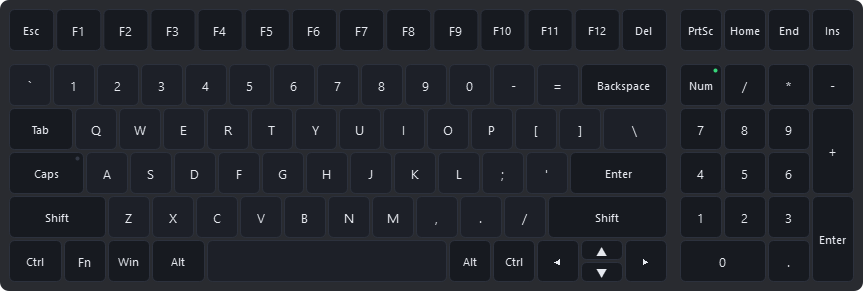
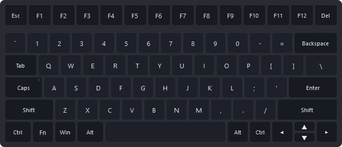

# KeyGnosys

### *Master Keys to Your System*

An **application-aware keyboard productivity and learning system**. KeyGnosys
puts a customizable keyboard on screen that lights up as you type, relabels
itself to match whatever you are holding, and shows the shortcuts for the
application you are actually in — so you learn them in the middle of real work
instead of from a cheat sheet. CapsLock becomes a configurable control layer,
giving you keyboard-driven mouse control and window management without leaving
the home row.



*Holding Ctrl in Chrome. Focus a different application and the same keys relabel
to its shortcuts. Keys with nothing bound dim themselves out of the way.*

## What it does

| | |
|---|---|
| **Learns you into the shortcuts you already have** | Standard and user-defined shortcuts appear on the keys, for the application currently focused |
| **Adapts to the active application** | Chrome shows Chrome's shortcuts; your editor shows its own |
| **Live visual feedback** | Keys and modifier states light up as you press them, so you can see what the machine thinks you typed |
| **A configurable CapsLock control layer** | Repurposes a key most people never use into a mode of your own design |
| **Keyboard-driven mouse and window control** | Pointer, clicks, scrolling, monitors and window switching, all from the home row |
| **A customizable visual keyboard** | Five bundled layouts, translucent, pinnable, click-through, and editable |

Once a shortcut is muscle memory you stop needing to see it — so the overlay can
be hidden entirely. **The overlay is optional; the input layer is not.**

---

## The idea

The keyboard on screen is not decoration. It shows a different set of labels
depending on what you are holding:

| | |
|---|---|
| **Base** — the characters |  |
| **Shift** — the shifted characters |  |
| **Ctrl** — the shortcuts **for the app you are focused on** |  |
| **CapsLock** — your cursor-control bindings |  |

The third one is the interesting one, and it is where the name comes from. Focus
Chrome and hold Ctrl and you get Chrome's shortcuts. Focus your editor and you
get your editor's. The labels come from plain JSON profiles matched against the
focused window, and you can edit or replace any of them.

This is the difference between a reference you go and look at and one that is
already in front of you at the moment you need it. Shortcuts get learned in the
course of doing the work, rather than in a separate act of study that never quite
happens.

---

## Status

**Milestone M1.** The on-screen keyboard works today. The native input core does
not exist yet, so the layer draws and teaches but does not yet drive the
pointer.

| | |
|---|---|
| ✅ | On-screen keyboard: five layouts, all four legend layers, key feedback, themes, opacity, pinning, click-through |
| ✅ | Data-driven layouts, bindings, themes and app profiles, with user overrides |
| ✅ | Segmented keys — a real L-shaped ISO Enter, drawn and hit-tested as one key |
| ✅ | Configuration persistence, graded validation, and diagnostics |
| 🚧 | Native core — key interception, pointer control, window management ([`core/`](core/README.md), milestones M2–M4) |
| 🚧 | Settings and visual binding editor (M5) |
| 🚧 | Visual layout editor (M6) |
| 🚧 | Installers (M7) |

Until the core lands, the overlay runs on a **mock backend** that reads Qt's own
key events. It lights up as you type, and it says so in the control bar — it
sees keys only while the app has focus, and it cannot suppress anything.

---

## Try it

```sh
git clone https://github.com/JohhannasReyn/KeyGnosys
cd KeyGnosys

python -m venv .venv
.venv/Scripts/activate          # Windows
# source .venv/bin/activate     # Linux

pip install -e .
keygnosys
```

Click the control bar, then type — the keys light up. Hold Ctrl to see the
shortcut layer, tap CapsLock to see the cursor layer.

On Linux, click-through additionally needs `pip install -e ".[x11]"`.

Useful flags:

```sh
keygnosys --list              # every layout, binding set, theme and profile found
keygnosys --check             # validate all documents; non-zero exit if any failed
keygnosys --layout thinkpad-compact --scale 0.8
keygnosys --backend mock      # force the mock backend
```

---

## Keyboard layouts

Five ship, and **adding another is dropping a JSON file into a directory** — no
code change, no recompile. That is a hard design requirement, not a nice-to-have.

| id | |
|----|---|
| `us-ansi-104` |  |
| `us-iso-105` |  |
| `thinkpad-compact` |  |
| `asus-vivobook-s` |  |
| `asus-zenbook` |  |

> **On "104" vs "105".** "105-key" conventionally means the ISO board; the
> standard US full-size keyboard is ANSI 104. Both ship under their conventional
> names, so neither set of users gets the wrong one.

### Key shapes

A key is drawn as **one or more rectangles** sharing a single identity. Nearly
every key is one rectangle; an ISO Enter is two, forming its L — 105 keys, 106
segments.

The segments are a drawing detail and nothing more: one key, one label, one
highlight, one hit-test target. Press Enter on an ISO board and the whole L
lights up, because it *is* one key. Click in the notch — inside its bounding box
but outside the key — and you hit the Backslash underneath, as you should.

The outline is drawn as a genuine union, so the inner corner of the L stays
square. Rounding it, which is what uniting two rounded rectangles would do,
leaves a visible pinch where the segments meet.

Arbitrary SVG paths were rejected: they solve one key shape at the cost of a node
editor, path hit-testing and path overlap detection, while rectangles keep
dragging, snapping and aligning trivial.

### Making your own

The laptop layouts are **representative templates**, not model-exact
reproductions — ThinkPad and Asus boards vary by model and year, and each
records the family it was modelled on in `metadata.model`. Correcting one to
match your actual machine is expected, so it is meant to be easy.

Note that the two Asus templates differ in the way that matters: `asus-zenbook`
has no numeric keypad, `asus-vivobook-s` does.

A **visual layout editor** is specified for M6: duplicate a template, drag keys
around, resize with handles, snap to a grid, align and distribute, edit the
segments of an L-shaped key, save under your own name, or reset back to the
template. Export produces the same JSON, so a layout you make is a file anyone
can drop into their own `layouts/`.

Until then, or if you would rather work in a text editor:

```sh
keygnosys --list                                   # find the id
cp data/layouts/us-ansi-104.json  ~/.config/keygnosys/layouts/mine.json
# on Windows: %APPDATA%\KeyGnosys\layouts\
```

Edit `id` and `name`, adjust the geometry, restart. A user file with the same
`id` as a bundled one replaces it, so an upgrade will not overwrite your work.
`tools/gen_layouts.py` is there if you would rather generate a board than place
104 rectangles by hand.

---

## Default cursor layer

Right hand steers, left hand clicks, so the clicking hand never interrupts
motion.

| Keys | |
|------|---|
| `H` `J` `K` `L` | Move the pointer — hold two for a diagonal |
| `F` | Hold for precision (slow) movement |
| `D` `S` `A` | Left / right / middle click |
| `Space` | Left click (thumb) |
| `X` · `G` | Double-click · drag lock |
| `Y` `U` `I` `O` | Scroll left / down / up / right — directly above the movement keys |
| `P` · `;` | Page up · page down |
| `1`–`9` | Jump to a running application (the key shows its name) |
| `N` · `M` | Previous / next window |
| `,` · `.` | Focus the previous / next monitor |
| `B` · `/` | **Move the focused window** to the previous / next monitor |
| Numpad `1`–`9` | Warp the pointer to that third of the screen |
| `'` | Warp to screen centre |
| `Esc` | Leave the layer |

All of it is `data/bindings/default.json`. Copy it to your config directory and
rebind anything.

CapsLock activation is configurable three ways — `hybrid` (tap latches, hold is
momentary; the default), `toggle`, and `hold`. Real CapsLock moves to
`Shift+CapsLock`.

---

## How it is put together

```
keygnosys-core (C++)                        keygnosys (Python / PySide6)
├── Input backend  evdev · hook       ├── Overlay: keyboard + control bar
├── Layer engine   the state machine  ├── Layout / theme / profile registry
├── Actions        cursor · windows   ├── Settings
└── IPC server ◄──── JSON Lines ────► └── Core client
   (privileged)      local socket        (unprivileged)
```

Two processes, because the input path needs privileges a GUI should never have,
and because typing must keep working when the overlay is closed, hidden, or
crashed. Everything latency-critical is on the core side; the IPC carries only
notifications and configuration, so a stalled GUI can never delay a keystroke.

- **[docs/OUTLINE.md](docs/OUTLINE.md)** — what it is and why the seams fall where they do
- **[docs/SPEC.md](docs/SPEC.md)** — file formats, wire protocol, state machine, action catalog, platform backends
- **[docs/LAUNCHING.md](docs/LAUNCHING.md)** — the launcher contract: options, prerequisites, autostart, exit codes (specified; implemented after M4)
- **[core/README.md](core/README.md)** — native core status and build

### Platform support

| | Windows 10/11 | Linux / X11 | Linux / Wayland | macOS |
|---|---|---|---|---|
| Overlay | ✅ | ✅ | partial | — |
| Click-through | ✅ | ✅ (needs `python-xlib`) | ❌ not possible | — |
| Input layer | 🚧 low-level hook | 🚧 evdev grab | ❌ | — |

**X11 is the supported Linux display environment for v1.** Wayland forbids, by
design, an application making its own window click-through, identifying the
focused window, or warping the pointer — and no single mechanism covers GNOME,
KDE and wlroots. The backend seam exists; the implementation does not, and no
compositor-specific code ships. It is documented rather than faked.

All detected keyboards are accepted as input, and they all map onto the one
layout you have selected. The overlay does not switch layouts based on which
keyboard you typed on — a map that redraws itself as your hands move between two
boards cannot be memorised, which is the entire point of it.

The Windows input path uses a low-level hook, which needs no driver and no admin
install. It cannot intercept keys while an elevated window has focus, and never
over `Ctrl+Alt+Del`. Both limits are surfaced in the UI. A signed Interception
driver backend can be added later behind the same interface.

---

## A note on trust

KeyGnosys is, structurally, a keylogger with a GUI. So:

- **No keystroke content is ever written to disk**, at any log level.
- **No network access, ever** — no telemetry, no update check, no crash upload.
- The IPC socket is **owner-only**; anything else reading it would see every key
  you type.
- Only **positional key codes** cross the wire. The core never resolves
  keystrokes to characters, so the stream cannot reconstruct typed text.
- The core takes **only** the privileges its backend needs — a udev rule on
  Linux, and no elevation at all on Windows by default.

See [SPEC section 12](docs/SPEC.md#12-security-and-permissions).

---

## Development

```sh
pip install -e ".[dev]"
pytest                                  # 90 tests, no display required
python tools/gen_layouts.py             # regenerate the bundled layouts
python tools/render_preview.py          # re-render the images in this README
```

The native core builds separately, with CMake:

```sh
cmake --preset default
cmake --build --preset default
ctest --preset default                  # no display, no privileges, no hardware
```

`cmake --preset debug` is the same build with `-Werror`; run it before
committing. Prerequisites and the other presets are in
[core/README.md](core/README.md).

The interesting logic — legend resolution, document validation, the action
catalog — is deliberately free of Qt imports so it can be tested without a
display. Same principle on the C++ side: the layer engine takes events and a
clock and returns decisions, and touches no OS API.

---

## Origins

This began as [`legacy/kbd_layer.c`](legacy/kbd_layer.c), a single-file Linux
evdev daemon with hardcoded bindings. The ideas that survive into the current
design are grab-and-reinject, the CapsLock race grace window, live config
reload, and the forwarded-release invariant that stops keys sticking down. What
changed is everything else: two platforms, arbitrary actions, data-driven
configuration, and a UI that can see what the engine is doing.

## Free, and staying that way

**KeyGnosys itself is free, clean and bloat-free.** No advertising, no
telemetry, and no paywall around the core application or its accessibility and
productivity functionality.

The no-telemetry half is not merely a promise — it is enforced in the
[specification](docs/SPEC.md#12-security-and-permissions), alongside the
commitment that no keystroke content is ever written to disk.

If a business is ever built here it belongs *around* the ecosystem — things like
profile libraries, creator content, synchronization, managed deployment or
support — and never inside the basic experience of using KeyGnosys. Drawing that
line now, before release, is the point: it means the line never has to be
redrawn later at someone else's expense.

## License

MIT — see [LICENSE](LICENSE).
